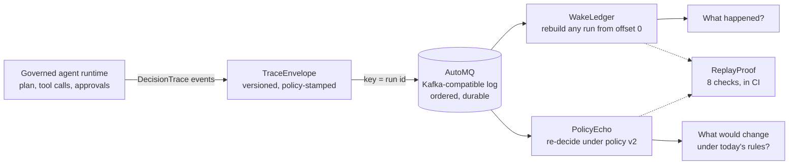

# TRACEWAKE

**Event-sourced governance for AI agents.** *Every decision leaves a wake. TRACEWAKE makes it replayable.*

[](https://github.com/gandhiashutosh14/tracewake/actions/workflows/ci.yml)


> **In plain English:** an AI agent that can act (query data, send a report, issue a refund) makes a
> stream of decisions: which tool to call, with what values, whether a rule allowed it, whether a
> person approved it. Most systems keep that history as logs, which get rotated and cannot be
> questioned later. TRACEWAKE treats it as evidence. Each decision is written to a durable,
> ordered, Kafka-compatible event log (AutoMQ), the full ledger of a run can be rebuilt from that
> log alone, and when the rules change, the recorded decisions can be re-decided under the new
> rules without repeating any side effect. This is a tested prototype on a public demo domain, not
> a production service.
>
> **Reading guide:** business readers can read the next three sections, then jump to
> [SWOT](#swot-analysis) and [where this applies](#where-this-applies). Engineers can go straight
> to [the demonstration](#the-demonstration) and [design](#design).

## The problem in plain English

A finance analyst asks an AI agent: "Forecast next year's revenue and send it to
finance@example.com." The agent plans four steps, runs three read-only queries, pauses for a person
to approve the send, and delivers the report. The runtime records every one of those decisions
in a journal. Then the runtime process ends, the journal file sits on one machine, and three
questions arrive later:

1. **"What exactly happened in that run?"** A reviewer needs the sequence of decisions, including
   what was refused, from a source that cannot have been edited after the fact.
2. **"Can we recover it after a crash?"** The journal must survive the process, the container and
   the disk it was written on.
3. **"The policy changed on Monday. Which of last month's actions would now be refused, and which
   refused ones would now pass?"** Nobody wants to re-run last month's agents to find out; the
   sends already happened.

The first two questions are what an append-only, replicated event log answers, and Kafka is the
protocol most organisations already run for exactly that. AutoMQ implements that protocol on
object storage, which makes keeping every decision cheap. The third question is what TRACEWAKE
adds: a replay that re-decides recorded actions under a new policy and says, for each one,
*unchanged*, *flipped*, or *the log does not hold enough evidence to say*.

The origin of this project is small: a note from the AutoMQ team introduced their open-source
Kafka to the author, whose other projects are about bounded, auditable agents. The question that
followed was what a Kafka log looks like when the events are not orders or clicks but decisions
made by an autonomous agent.

## Executive summary

| Question | Answer |
|---|---|
| What problem does this address? | Agent decisions are kept as disposable logs. They should be durable, ordered, reconstructible evidence that can be re-examined when policies change. |
| Who has this problem? | Anyone deploying agents that act on real systems: platform teams, risk and compliance functions, and the engineers who answer "why did the agent do that?" |
| What does this repository do? | Publishes a governed agent's decision trace to a Kafka-compatible log as versioned envelopes, rebuilds the ledger from the log alone, and replays recorded tool decisions under a changed policy. A proof pack verifies all of it. |
| What has been shown so far? | On four recorded runs (40 events): the ledger rebuilt from the log equals the source, survives being destroyed and rebuilt, and ignores duplicate delivery; 7 decisions were replayed under a changed policy with 0 mismatches against the record, 2 flipped and 0 needing evidence; 8 of 8 checks pass ([`reports/demo-memory.md`](reports/demo-memory.md)). The same proof runs in CI against a real AutoMQ 1.7.4 + MinIO cluster. 59 unit tests. |
| How mature is it? | v0.1 prototype. The runs come from the author's [governed-agent-orchestrator](https://github.com/gandhiashutosh14/governed-agent-orchestrator) on a public sample database, with a deterministic planner and no language model. |
| What it is not | Not a Kafka fork or an AutoMQ plug-in; not a benchmark of AutoMQ; not a full policy engine. It replays argument constraints, effect classes and approval requirements, which is what the orchestrator's guard decides. |
| What it would take to use it for real | A live recorder in your agent runtime (one line with the orchestrator), a schema registry for the envelope, retention and access rules on the topic, and the Iceberg projection planned for v0.2 so the ledger is queryable with SQL. |

## How it works, end to end



1. **The agent runs and journals.** The orchestrator emits one event per decision: `plan_accepted`,
   `tool_call_allowed`, `tool_call_denied`, `approval_required`, `approval_granted`, `step_finished`
   and so on, each with a sequence number ([`fixtures/orchestrator/`](fixtures/orchestrator/) holds
   four recorded runs with their provenance).
2. **Recorder wraps each event in a TraceEnvelope** and publishes it with the run id as the message
   key, so a run stays in order on one partition. The envelope carries the id of the policy in
   force, a hash of the catalog's constraints ([`tracewake/envelope.py`](tracewake/envelope.py),
   [`tracewake/recorder.py`](tracewake/recorder.py)).
3. **The log keeps it.** Locally that is an in-memory log with partitions and offsets; in CI it is
   AutoMQ 1.7.4 with MinIO as its object storage, spoken to through kafka-python
   ([`tracewake/bus.py`](tracewake/bus.py), [`docker/compose.yaml`](docker/compose.yaml)).
4. **WakeLedger reads the topic from offset zero** and inserts every envelope under the key
   `(run_id, seq)`. Re-reading, restarting, or receiving a message twice changes nothing
   ([`tracewake/ledger.py`](tracewake/ledger.py)).
5. **PolicyEcho recovers each recorded decision's arguments from the log**, recomputes the decision
   under the old policy to prove it matches the record, then recomputes it under the new policy
   ([`tracewake/echo.py`](tracewake/echo.py), [`tracewake/policy.py`](tracewake/policy.py)).
6. **ReplayProof checks all of the above** and writes a report with the numbers, the environment
   and the commit ([`tracewake/proof.py`](tracewake/proof.py)).

**Worked example.** Policy v1 allows reports to `example.com`. Policy v2 moves the allowed domain
to `example.org` and caps a ranking query at two rows. Replaying the four recorded runs
([`policies/v1.json`](policies/v1.json) to [`policies/v2.json`](policies/v2.json)):

| Run | Decision | Under v1 (recorded) | Under v2 (replayed) | Why |
|---|---|---|---|---|
| allowed | `send_report(recipient=finance@example.com)` | ALLOWED, approved by a person, delivered | **DENIED** | `finance@example.com` is not in an allowed domain (`example.org`) |
| partner | `send_report(recipient=partner@example.org)` | DENIED at plan time | **ALLOWED** | the violation "not in an allowed domain (`example.com`)" no longer applies |
| denied | `send_report(recipient=finance@evil-example.org)` | DENIED at plan time | DENIED | still not an allowed domain |
| allowed, exhausted | four read-only calls | ALLOWED | ALLOWED | unchanged |

Nothing was re-executed: the report that was sent in the "allowed" run was sent once, under v1.
The replay only says that the same request would be refused today, and that a request refused
last month would now go through. Two budget denials in the "exhausted" run are listed but not
re-decided, because a call budget is runtime state, not policy.

## The demonstration

No broker is needed for the first command.

```bash
git clone https://github.com/gandhiashutosh14/tracewake.git
cd tracewake
python -m venv .venv && . .venv/bin/activate        # Windows: .venv\Scripts\activate
pip install -e ".[dev]"
pytest -q                                            # 59 passed
tracewake demo --out reports/demo-memory.md          # in-memory log: 8 of 8 checks
tracewake echo --from policies/v1.json --to policies/v2.json
```

Against a real AutoMQ cluster (Docker required; this is what CI does):

```bash
docker compose -f docker/compose.yaml up -d          # AutoMQ 1.7.4 + MinIO
python scripts/wait_for_broker.py localhost:9092
tracewake proof --bootstrap localhost:9092 --out reports/replayproof-automq.md
docker compose -f docker/compose.yaml down -v
```

`tracewake publish` and `tracewake ledger` do the two halves separately against any topic, and
[`scripts/make_fixtures.py`](scripts/make_fixtures.py) re-records the fixtures from a checkout of
the orchestrator.

## What is measured, and how

| Measure | How | Result on the in-memory log ([report](reports/demo-memory.md)) |
|---|---|---|
| Every published event reaches the ledger | count and validity of consumed messages | 40 published, 40 inserted, 0 invalid |
| No gaps in any run | sequence numbers 1..max per run | 4 runs, 0 gaps |
| Ledger equals the source | per-run digest of envelopes in sequence order | 4 of 4 digests equal |
| Rebuild after destruction | ledger emptied, topic re-read from offset 0 | digests equal |
| Duplicate delivery is harmless | one run published twice | 0 inserted, digests equal |
| Replay is faithful to the record | every decision recomputed under the old policy | 7 checked, 0 mismatches |
| Replay from ledger equals replay from source | row-by-row comparison | 7 rows equal |
| The policy change is visible | flips counted | 2 flipped, 0 need evidence |

The proof against AutoMQ runs on every push in the `automq` job of
[the workflow](.github/workflows/ci.yml); its report is uploaded as a build artifact and the
committed copy in [`reports/`](reports/) names the run it came from. Timings in the reports are
what the machine that ran them measured; they are not a benchmark of AutoMQ.

## Design

| Subsystem | What it is | Where |
|---|---|---|
| **TraceEnvelope** | The versioned event: `run_id`, `seq`, `ts`, `type`, `data`, plus `policy_id`, `producer`, `envelope_version`. Validated on the way in and on the way out; canonical JSON so digests are stable. | [`tracewake/envelope.py`](tracewake/envelope.py) |
| **Recorder** | Plugs into the orchestrator's `DecisionTrace.subscribe()` for live use, or publishes recorded JSONL files. | [`tracewake/recorder.py`](tracewake/recorder.py) |
| **WakeLedger** | SQLite ledger keyed by `(run_id, seq)`; idempotent ingest; per-run digests, gap detection, and the questions a reviewer asks (irreversible calls, denials, approvals). | [`tracewake/ledger.py`](tracewake/ledger.py) |
| **PolicyEcho** | Recovers each decision's arguments from the log, recomputes under old and new policy, classifies `unchanged`, `flipped`, `needs-evidence`. Constraint semantics are a line-for-line match of the orchestrator's guard, cross-checked by a test. | [`tracewake/echo.py`](tracewake/echo.py), [`tracewake/policy.py`](tracewake/policy.py) |
| **ReplayProof** | The eight checks and the report. | [`tracewake/proof.py`](tracewake/proof.py) |
| **LakeMirror** (v0.2, planned) | The same topic projected into an Apache Iceberg table through AutoMQ's Table Topic, queryable with SQL. | not yet |

Two design choices worth knowing. Decisions are replayed only when the log holds the arguments
the guard saw; a `needs-evidence` verdict is a finding about the log, not a guess. And the replay
first reproduces the past (0 mismatches required) before it predicts the change, which is what
makes the flip table credible.

## What this does not claim

- The demo domain is a public sample database with a deterministic planner; there is no language
  model in the loop and the four runs are the ones in `fixtures/`.
- "Policy" here means the orchestrator's catalog constraints, effect classes and approval
  requirements. Call budgets, planner behaviour and human judgement are not replayed.
- The orchestrator does not record a refused call's resolved arguments, only the violation text.
  Such calls replay as `needs-evidence` when the new policy constrains a referenced argument. Adding
  the arguments to that event upstream is the obvious next fix.
- Nothing here measures AutoMQ's cost or latency. AutoMQ's own figures are AutoMQ's; see their
  documentation.
- TRACEWAKE is an independent project and is not affiliated with or endorsed by AutoMQ.

## Project layout

```
tracewake/            envelope, bus, recorder, policy, ledger, echo, proof, cli
policies/             v1.json (the orchestrator's catalog) and v2.json (the changed policy)
fixtures/orchestrator four recorded runs and PROVENANCE.json
tests/                59 tests; the in-memory log is enough for all of them
docker/compose.yaml   AutoMQ 1.7.4 + MinIO, adapted from AutoMQ's own compose file
scripts/              make_fixtures.py, wait_for_broker.py
reports/              committed proof reports with the command and revision that produced them
docs/DEVELOPMENT_NOTES.md   how this was built, including what the tests caught
NOTICE.md             third-party attribution
```

## SWOT analysis

A SWOT analysis lists **S**trengths and **W**eaknesses (inside the project) and
**O**pportunities and **T**hreats (outside it).

| | Helpful | Harmful |
|---|---|---|
| **Internal** | **Strengths**<br>• The ledger is rebuilt from the log alone, and the proof destroys and rebuilds it to show that.<br>• Replay reproduces the record before it predicts the change; 0 mismatches is a hard check, not a claim.<br>• Envelopes carry the policy id, so "which rules were in force" is in the data, not in someone's memory.<br>• Runs on any Kafka-protocol log; the in-memory log makes every test broker-free.<br>• 59 tests, and a cross-check against the original guard's semantics. | **Weaknesses**<br>• Four recorded runs from one demo domain; no language model, no real traffic.<br>• Refused calls lack resolved arguments in the source trace, so some replays end as `needs-evidence`.<br>• Only constraint, effect and approval policy is replayed; budgets and planner behaviour are not.<br>• No schema registry, retention policy or access control yet; the topic is trusted as-is.<br>• Timings are from a laptop and a CI runner, not a load test. |
| **External** | **Opportunities**<br>• Regulation increasingly asks for record-keeping of automated decisions (the EU AI Act's Article 12, GDPR Article 22); a durable decision log is the raw material.<br>• AutoMQ's Table Topic can project the same topic into Apache Iceberg, which turns the ledger into SQL without another pipeline (v0.2).<br>• Any agent runtime with a subscribe hook can produce TraceEnvelopes; the envelope is small and versioned on purpose.<br>• Kafka is already in most enterprises; this adds no new infrastructure. | **Threats**<br>• Agent frameworks and observability vendors are adding tracing and replay features; the differentiator has to stay the faithful, policy-aware replay.<br>• Kafka-protocol drift: kafka-python and AutoMQ track Kafka 3.9; a protocol change needs re-testing.<br>• A decision log holds sensitive arguments (addresses, amounts); without redaction and access control it is a liability as well as evidence.<br>• Policy formats vary; the replay works for catalogs shaped like the orchestrator's. |

## Where this applies

These are illustrative examples of where the pattern fits. None of them is a deployment of this code.

| Industry | Example use case | What this project's approach contributes |
|---|---|---|
| Banking and payments | An assistant that prepares customer notices and starts refunds | Every refund decision is durable evidence; when limits change, replay shows which past approvals would now fail. |
| Insurance | A claims agent that reads policies and requests payouts | Payout requests are keyed by claim and ordered; auditors rebuild a claim's decision history from the log. |
| Healthcare administration | A scheduling agent that reads calendars and sends reminders | Allowed-recipient rules change; replay finds which historical sends would now be refused. |
| E-commerce and retail | A support agent that issues goodwill credits | Credit limits tighten; the flip table tells finance the exposure under the old rule. |
| IT operations | An agent that restarts services or changes settings | Effect classes and approvals are in the envelope; a post-incident review reads the ledger, not scattered logs. |
| Public sector | Case-handling assistants under record-keeping duties | A tamper-evident, reconstructible decision record with the policy version on every event. |
| SaaS platforms | Multi-tenant agent products | One topic per tenant, one partition key per run; customers can be given their own ledger. |

## Glossary

| Term | Plain-English meaning |
|---|---|
| AI agent | Software in which a language model chooses which tools to call to finish a task. |
| Governed agent | An agent whose tool calls pass through a checker (constraints, budgets, approvals) before they run. |
| DecisionTrace | The orchestrator's journal: one numbered event per decision in a run. |
| Event log | An append-only sequence of messages that readers consume in order; Kafka is the common protocol. |
| AutoMQ | An open-source implementation of the Kafka protocol that stores data on object storage such as S3. |
| Partition key | The value that decides which partition a message goes to; TRACEWAKE uses the run id so a run stays ordered. |
| Offset | A message's position in its partition; reading "from offset 0" means reading everything. |
| Envelope | The wrapper around an event that carries version, producer and policy information. |
| Policy id | A hash of the rules in force when a decision was made, stamped on every envelope. |
| Ledger | The rebuilt, queryable record of a run, derived only from the log. |
| Replay | Re-deciding recorded actions under a different policy without executing anything. |
| Needs evidence | A replay verdict meaning the log does not contain a value the new policy would need. |
| Idempotent | An operation that has the same result however many times it is applied; ledger inserts are. |
| Table Topic | AutoMQ's feature that writes a topic into an Apache Iceberg table. |

## Further reading

| Resource | What it is | Why it matters here |
|---|---|---|
| [AutoMQ](https://github.com/AutoMQ/automq) and its [overview](https://docs.automq.com/automq/what-is-automq/overview) | The Kafka-protocol log on object storage used in CI. | The log TRACEWAKE writes to; the compose file is adapted from theirs. |
| [Agent audit trails: turning AI actions into replayable event streams](https://www.automq.com/blog/agent-audit-trails-turning-ai-actions-into-replayable-event-streams) | AutoMQ's argument for ordered, durable, replayable agent audit records. | The architectural idea this repository turns into runnable, verified code. |
| [AI workflow replay: debugging decisions with Kafka-compatible streams](https://www.automq.com/blog/ai-workflow-replay-debugging-decisions-with-kafka-compatible-streams) | AutoMQ on replaying agent workflows from streams. | PolicyEcho is a specific form of replay: under a changed policy, with a faithfulness check. |
| [Apache Kafka design](https://kafka.apache.org/documentation/#design) | Why Kafka keeps ordered, durable, replayable partitions. | The two guarantees the ledger depends on: order within a key and re-readable offsets. |
| [Event Sourcing](https://martinfowler.com/eaaDev/EventSourcing.html), Martin Fowler | The pattern of storing state as an append-only sequence of events and rebuilding from it. | WakeLedger is event sourcing applied to agent decisions. |
| [Turning the database inside out](https://www.confluent.io/blog/turning-the-database-inside-out-with-apache-samza/), Martin Kleppmann | The log as the source of truth and every other store as a derived view. | The ledger is a derived view; the log is the truth. |
| [AutoMQ client SDK guide](https://docs.automq.com/automq-cloud/getting-started/client-sdk-guide) | Which Kafka clients AutoMQ recommends. | kafka-python is the listed Python client, which is why TRACEWAKE uses it. |
| [AutoMQ Table Topic](https://docs.automq.com/automq/table-topic/overview) and [Apache Iceberg](https://iceberg.apache.org/) | Writing a topic into an Iceberg table. | The v0.2 LakeMirror plan. |
| [LangGraph interrupts](https://docs.langchain.com/oss/python/langgraph/interrupts) | How the orchestrator pauses for human approval. | Explains the `approval_required` and `approval_granted` events in the fixtures. |
| [OWASP: Excessive Agency](https://genai.owasp.org/llmrisk/llm062025-excessive-agency/) | The risk of agents with more permissions than they need. | A durable record of what an agent was allowed to do is part of the mitigation. |
| [EU AI Act, Article 12: record-keeping](https://artificialintelligenceact.eu/article/12/) and [NIST AI RMF](https://www.nist.gov/itl/ai-risk-management-framework) | Record-keeping duties and risk vocabulary for AI systems. | Why decision logs are becoming a requirement, not a nice-to-have. |

## Roadmap

- **v0.2 LakeMirror:** enable Table Topic in the compose stack, register the envelope schema, and
  read the Iceberg table back with PyIceberg to prove it equals the ledger.
- **Upstream:** record a refused call's resolved arguments in the orchestrator's `tool_call_denied`
  event, so those decisions replay without a `needs-evidence` verdict.
- **Live recorder demo:** run the orchestrator with the Recorder subscribed, against the compose
  stack, in CI.

See [docs/DEVELOPMENT_NOTES.md](docs/DEVELOPMENT_NOTES.md) for how this was built and what the
tests caught, and [NOTICE.md](NOTICE.md) for third-party attribution.

## License

MIT. See [LICENSE](LICENSE).
